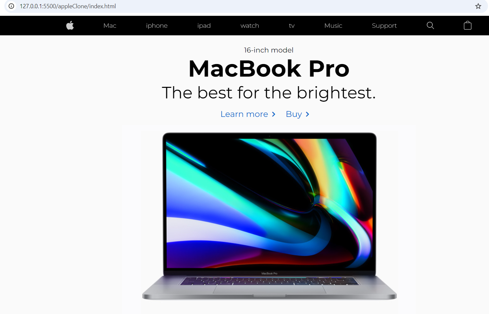

# Apple.com Cloning Project

## Project Description
This project is a clone of the Apple.com webpage, created to showcase our frontend development skills using HTML and CSS. The project aims to replicate the design and layout of the Apple.com webpage.

## Table of Contents
- Installation
- Usage
- Features
- Screenshots
- Contributing
- License
- Contact

## Installation
To get a local copy up and running, follow these steps:

1. Clone the repository:
   ```bash
   git clone https://github.com/Daniel-Optimist/appleClone.git
## USage 
Open the index.html file in your browser to view the project.
## Features
- Pixel-perfect layout
- Responsive design and CSS animations (features that will be added in the future)

## Screenshots 

## Contributing 
Contributions are welcome! Please fork the repository and create a pull request with your changes.
## Licence 
Not applicable or Distributed under the MIT License. See LICENSE for more information.
## Contact 
Hagos, Abel, Daniel Getu Eyerus and Nigusea - your.email@example.com Project Link: https://github.com/Daniel-Optimist/appleClone